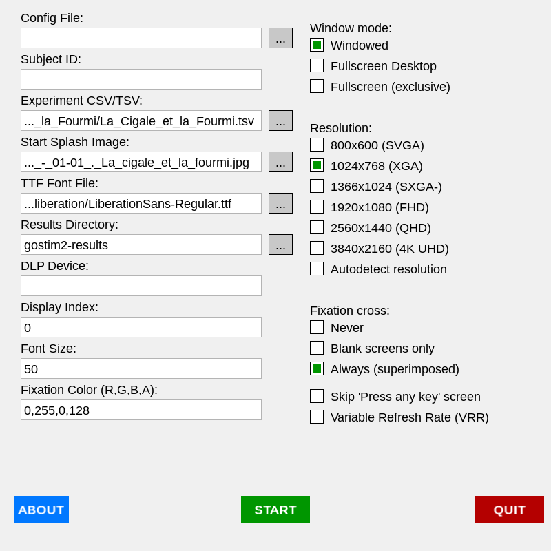

# Gostim2

Gostim2 is a multimedia stimulus delivery system designed for experimental psychology and cognitive neuroscience tasks.

* [HTML version](http://chrplr.github.io/gostim2) of this document  
* [Github repository](http://github.com/chrplr/gostim2) of this project
* [Installers](https://github.com/chrplr/gostim2/releases) for various platforms


Building and running an experiment with gostim2 does not require any programming knowledge as *the experimental paradigm is fully described in a table that describes the stimuli and their timing.*
Indeed, Gostim2 is meant for expriments where the stimuli are presented according to a *fixed schedule, known in advance*. Although all keypress events are saved with timestamps, the behavior of the program cannot be modified in real-time, e.g., it is not possible to provide real-time feedback. Gostim2 has no notion of "trial", only stimuli and events. This approach is well suited for fMRI/MEG/EEG experiments with fixed stimulus presentation schedules.

Remark: For general purpose, flexible programs for building psychology experiments, you can check [goxpyriment](https://chrplr.github.io/goxpyriment) (in [Go](http://go.dev)), or [expyriment](https://www.expyriment.org) (in [Python](http://www.python.org)).

Christophe Pallier Feb. 2026

---

Here is a preview of the graphical interface (see below for explanations)



---
## Table of Contents
- [Usage](#usage)
  - [Quick Start](#quick-start)
  - [GUI Mode](#gui-mode)
  - [CLI Mode](#cli-mode)
  - [Linux Performance Note](#linux-performance-note)
-- [Experiment Configuration (CSV)](#experiment-configuration-csv)
  - [Stimulus Types](#stimulus-types)
- [Features](#features)
- [Installation](#installation)
  - [Precompiled Binaries (Recommended)](#precompiled-binaries-recommended)
    - [Making the commands available from anywhere (Optional)](#making-the-commands-available-from-anywhere-optional)
  - [Building from Source](#building-from-source)
 [License & Credits](#license--credits)


---

## Usage

There are two apps: a command line one (`gostim2`) and a graphical one (`gostim2-gui`).


### Quick Start
1. **Launch the GUI**: Run `./gostim2-gui`.
2. **Configure**:
   - Click **"..."** next to **Experiment CSV** and select the csv file in `examples/Visual_Categories_Localizer_Minye_Zhan_(demo)`.
   - The stimuli directory is detected automatically: the program searches for a `stimuli/` or `assets/` subfolder next to the CSV file.
3. **Start**: Click the green **START** button. 
4. **Interact**: Press any key when the "Press any key to start" message appears.
5. **Exit**: Press **Escape** at any time to interrupt the experiment.

### GUI Mode
The GUI provides an interactive setup window to configure file paths, resolution, and experimental options. Settings are automatically cached for the next session.

**Resolution**: Choose a fixed resolution from the list, or check **Autodetect resolution** to use your monitor's native resolution automatically. This setting is independent of the window mode.

**Window mode** (three mutually exclusive options):
- **Windowed** — standard window at the chosen resolution.
- **Fullscreen Desktop** — borderless fullscreen at the desktop resolution, with the OS compositor still active. The safest option; recommended for everyday use.
- **Fullscreen (exclusive)** — takes exclusive control of the display and bypasses the OS compositor. Minimises latency and prevents compositor-induced frame drops. Recommended for EEG/MEG/fMRI recordings. Note: this mode can crash on some systems or configurations.

### CLI Mode
For automated or console-only environments:
```bash
./gostim2 -csv experiment.csv [options]
```
**Common Options:**
- `-csv` / `-tsv`: Path to the stimulus CSV or TSV file (required).
- `-results-dir`: Directory where result files are saved (default: `gostim2-results`). **Note**: If a relative path is provided, it is resolved relative to the directory of the CSV file.
- `-stimuli-dir` / `-assets`: Directory containing image and sound assets. If omitted, the program automatically searches for a `stimuli/` or `assets/` folder in the same directory as the CSV file.
- `-res`: Screen resolution (e.g., `1920x1080` or `Autodetect` to use the native resolution).
- `-font`: Path to a TTF font file.
- `-fullscreen`: Run in exclusive fullscreen mode (bypasses OS compositor).
- `-fullscreen-desktop`: Run in fullscreen desktop mode (borderless, compositor active).
- `-display`: Index of the display to use (default: `0`).
- `-dlp`: Serial device path for DLP-IO8-G triggers (e.g., `/dev/ttyUSB0`).

### Results Management
By default, `gostim2` saves a timestamped TSV file containing the event log in a folder named `gostim2-results`. 

To ensure experiments are portable and organized, **the results directory is always resolved relative to the location of your CSV file** (unless an absolute path is specified).

For example:
- Running `gostim2 -csv study1/run1.csv` will save results to `study1/gostim2-results/`.
- Running `gostim2 -csv study1/run1.csv -results-dir data` will save results to `study1/data/`.
- Running `gostim2 -csv study1/run1.csv -results-dir ""` will save the results file directly in `study1/`.

### Linux Performance Note
To minimize video latencies on Linux, you can run the CLI version from a TTY console (e.g., Ctrl-Alt-F3) after stopping the display manager (e.g., `systemctl stop gdm`). This allows the app to bypass Wayland/X11 and use the **Direct Rendering Manager (DRM)** directly.


## Experiment Configuration (CSV)

The stimuli scehdule is described in a table saved as a CSV or TSV file. This type of file can be created and edited with Spreadsheet software like LibreOffice Calc or Excel (see <https://ec.europa.eu/eurostat/web/user-guides/data-browser/download-data/tsv-excel>) or even a text file editor.

The CSV or TSV file given as input to gostim2 must include at least these four columns in its header: `onset_time`, `duration`, `type`, and `stimuli`. Extra columns (e.g. `experimental_condition`) are allowed and will be preserved in the output log.


**Toy Example (`experiment.csv`):**
```csv
onset_time,duration,type,stimuli
1000,500,IMAGE,body01.png
2000,300,IMAGE_STREAM,face01.png:200:100~face02.png:200:100~face12.png:200:100
3000,500,TEXT,Hello !
4000,2000,BOX,Please press\nany key
7000,1,SOUND,sound02.wav
```

### Stimulus Types
- **IMAGE / SOUND / TEXT**: Standard single-item stimuli.
- **BOX**: Displays multiline text centered on the screen. Use `\n` for literal line breaks within the `stimuli` string.
- **IMAGE_STREAM**: Displays a sequence of images in rapid succession. 
    - The `stimuli` column contains filenames separated by `~`.
    - **Timing (Optional)**: Each item can use the format `filename:duration:gap`.
        - `duration`: Time in ms to show the image.
        - `gap`: Time in ms to show a blank screen (or fixation cross) after the image.
    - If timing is omitted, the value from the `duration` column is used as the frame duration with a 0ms gap.
- **TEXT_STREAM**: Displays a sequence of text strings in rapid succession. Supports the same `:duration:gap` timing format.
- **SOUND_STREAM**: Plays a sequence of sound files. Supports the same `:duration:gap` format, where `duration` is the SOA (Stimulus Onset Asynchrony).

**Notes on Timing:**
- For `SOUND` types, the `duration` column is required but the sound will play until completion (use `1` or any placeholder value).
- All timestamps in the CSV and output logs are in milliseconds.

---

## Features

- **Precise Timing:** High-resolution timing loop with VSYNC synchronization and predictive onset look-ahead.
- **Flexible Fullscreen:** Three window modes — Windowed, Fullscreen Desktop (borderless), and Fullscreen Exclusive (bypasses OS compositor for minimal latency). Resolution autodetection is independent of the chosen mode.
- **Low-Latency Audio:** Uses a custom software mixer to minimize startup delay and ensure thread-safety.
- **Text Stimuli:** Support for rendering text via TTF fonts.
- **Unified Event Log:** Records stimulus onsets, offsets, and user responses in a single CSV file with a comprehensive metadata header.
- **Splashscreens:** Optional start and end screens that wait for user input.
- **Advanced Display Options:** Supports custom resolutions, logical scaling, and multiple monitors.
- **Cross-Platform:** Binaries available for Linux, Windows, and macOS (x86_64 and ARM64).
- **Serial Triggers:** Support for DLP-IO8-G devices via `go.bug.st/serial` (no CGo required).

---

## Installation

### Precompiled Binaries (Recommended)

If you just want to run the application, the easiest way is to download a pre-built version for your computer.

1.  **Download:** Go to the [GitHub Releases](https://github.com/chrplr/gostim2/releases) page.
2.  **Choose your installer (Easiest):**
    -   **Windows:** Download **`gostim2-setup.exe`**. Run it to install the app. It installs to your local `AppData` folder (no admin rights required) and creates desktop shortcuts.
        - *Note: The **examples** folder is installed in `%LOCALAPPDATA%\gostim2\examples` (usually `C:\Users\<YourName>\AppData\Local\gostim2\examples`).*
    -   **macOS:** Download **`gostim2-macos-arm64.zip`**. Extract it and drag **gostim2.app** to your Applications folder (or anywhere you like).

        > [!WARNING]
        > macOS may show a security warning the first time you open the app. See [macOS installation and security](https://chrplr.github.io/note-about-macos-unsigned-apps) for an explanation and step-by-step instructions to bypass it.


    -   **Linux (Universal):** Download **`gostim2-x86_64.AppImage`**. Right-click the file, go to **Properties > Permissions**, check **"Allow executing file as program"**, and double-click to run.
    -   **Ubuntu/Debian:** Download the **`.deb`** file (choose `amd64`) and install it by double-clicking or running `sudo apt install ./gostim2_*.deb`.
3.  **Alternative: Raw Binaries:** If you prefer not to use an installer, you can download the `.zip` (Windows) or `.tar.gz` (Linux/macOS) files matching your processor:
    -   **Windows:** `windows` and `x86_64`.
    -   **macOS (Apple Silicon/M1/M2):** `macos` and `arm64`.
    -   **macOS (Intel):** `macos` and `x86_64`.
    -   **Linux (PC/Intel):** `linux` and `x86_64`.
4.  **Run:** Once installed or downloaded, you can run the application (you may need to grant permission in your security settings on macOS).

### Building from Source

Do this only if you want to compile the project on your computer. This is the way to go if you want to debug and/or add new functions to the programs.


#### Prerequisites
- **Go 1.25** or later (only if building from source).
- **SDL3 libraries**: 
  - **Windows**: DLLs are typically bundled with releases.
  - **macOS**: `brew install sdl3 sdl3_image sdl3_ttf`
  - **Linux**: Install `sdl3`, `sdl3_image`, and `sdl3_ttf` via your package manager (e.g., `apt install libsdl3-0 libsdl3-image-0 libsdl3-ttf-0`).


To see all available build targets:
```bash
make
```

To build both the CLI and GUI versions for the current platform:
```bash
make build
```

To build for all supported platforms (Linux, Windows, macOS — x86_64 and ARM64), with outputs placed in `dist/`:
```bash
make build-multiplatform
```

To install the binaries to your `$GOPATH/bin`:
```bash
make install
```

#### Shell Completion (Bash & Zsh)

To enable tab-completion for `gostim2` options, you can install the completion scripts:

```bash
make install-completion
```

After installation, restart your terminal or source the completion file to activate it.

To remove built binaries and the `dist/` folder:
```bash
make clean
```

#### Making the commands available from anywhere (Optional)

To run `gostim2` or `gostim2-gui` from any terminal window without typing their full path, you can move them to a "global" location on your computer.

##### Linux & macOS
1. Open a terminal in the folder where your binaries are located.
2. Move the files to a standard system folder (you will be asked for your password):
   ```bash
   sudo mv gostim2 gostim2-gui /usr/local/bin/
   ```
3. **macOS Security Note**: If you downloaded the binaries, macOS may block them from running. You can fix this by running this command in the terminal:
   ```bash
   sudo xattr -dr com.apple.quarantine /usr/local/bin/gostim2*
   ```
   *Alternatively, if you see a "blocked" message when trying to run the app, go to **System Settings > Privacy & Security** and click **"Open Anyway"** at the bottom of the page.*
4. You can now start the program from any folder by simply typing `gostim2` or `gostim2-gui`.

##### Windows
**Option A: Automate with PowerShell (Recommended)**
1. Open the folder where you have downloaded the `.exe` files and `install-windows.ps1`.
2. Right-click on **`install-windows.ps1`** and select **Run with PowerShell**. 
3. If prompted to run as **Administrator**, click **Yes**. The script will automatically copy the files to `C:\Program Files\gostim2` and update your system `PATH`.

**Option B: Manual Setup**
1. Create a folder (e.g., `C:\bin`) and move the `.exe` files into it.
2. Press the **Windows Key**, type "environment variables", and select **Edit the system environment variables**.
3. Click the **Environment Variables...** button.
4. In the "User variables" list, select **Path**, then click **Edit...**.
5. Click **New** and type the path to your folder (e.g., `C:\bin`).
6. Click **OK** on all windows to save.
7. Restart any open Command Prompt or PowerShell windows for the changes to take effect.


# License & Credits

[Gostim2](http://github.com/chrplr/gostim2) is a port of [audiovis](https://chrplr.github.io/audiovis/) to Go using the [go-sdl3](https://github.com/Zyko0/go-sdl3) bindings.

Author: [Christophe Pallier](http://www.pallier.org) <christophe@pallier.org> using Gemini CLI and Claude.

The code is distributed under the [GNU General Public License v3](LICENSE.txt).

